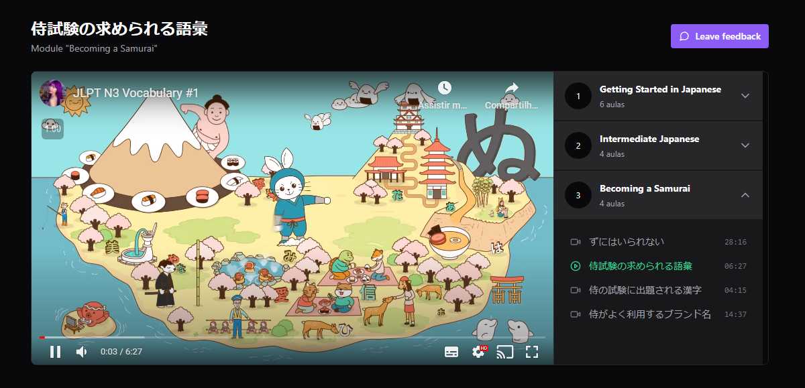

# Redux and Zustand

<p align="center">
  

   <a href="https://github.com/GianDutra/ignite_redux_zustand/commits/master">
    
  </a>
  
 <a href="https://ignite-redux-zustand-three.vercel.app/">
    
  </a>
  
</p>


> Special module from Rocketseat that covers Redux and Zustand, teaching how to use each of them and their main differences. It also taught how to test them using Vitest and Redux DevTools.

## Tech Stack

To create the website, the following was used:

#### **Website**    ([React](https://reactjs.org/)  +  [Vite](https://vitejs.dev/)  +  [TypeScript](https://www.typescriptlang.org/))
- **[Redux](https://redux.js.org/)**
- **[Redux Toolkit](https://redux-toolkit.js.org/)**
- **[Redux Thunk](https://github.com/reduxjs/redux-thunk)**
- **[Zustand](https://zustand.surge.sh/)**
- **[Vitest](https://vitest.io/)**
- **[Axios](https://axios-http.com/)**
- **[TailWindCSS](https://tailwindcss.com/)**
- **[Lucide](https://lucide.dev/)**
- **[RadixUI](https://www.radix-ui.com/)**
- **[React Player](https://github.com/cookpete/react-player)**

#### **API**
- **[JsonServer](https://github.com/typicode/json-server)**

## 💻 Prerequisites

Before you start, make sure you have installed:

* [Node.js](https://nodejs.org/en/)
* [Git](https://git-scm.com)

## 🚀 Installing <ignite_redux_zustand>

 
```bash

# Clone this repository
$ git clone https://github.com/GianDutra/ignite_redux_zustand.git

# Access the project folder in your terminal
$ cd ignite_redux_zustand

# Install the dependencies
$ npm install

# Run the application in developer mode
$ npm run dev

# The app will open by default on port: 5173 - go to http://localhost:5173/

```

---


## 👨‍💼 Author

<table>
  <tr>
    <td align="center">
      <a href="#">
        <br>
        <sub>
          <b>Gian Dutra</b>
        </sub>
      </a>
    </td>
  </tr>
</table>
